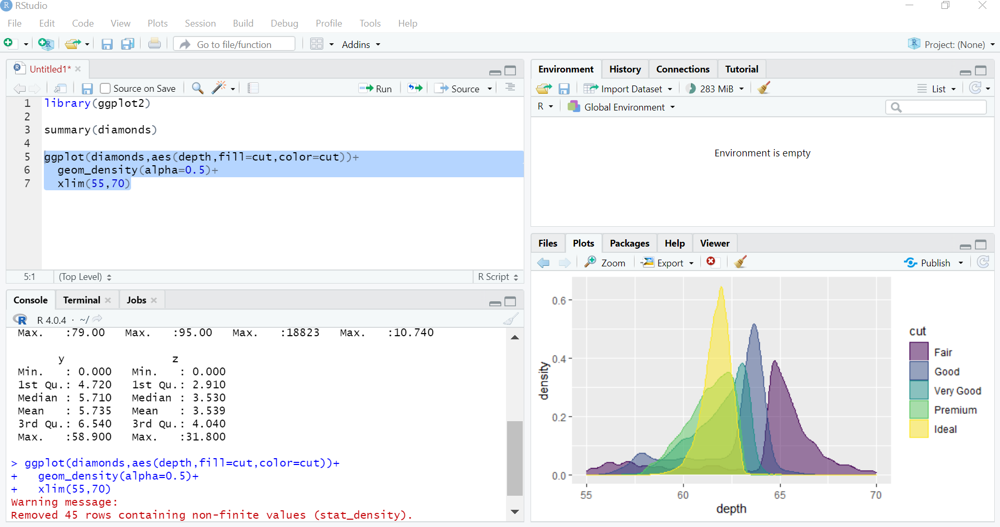

```{r setup, echo = F}
knitr::opts_chunk$set(fig.retina = 4, warning = FALSE, message = FALSE, fig.height = 5, fig.width = 7)
```
# Download R and RStudio

--

## R Installation

-   Windows: go to <https://cran.r-project.org/bin/windows/base/> and
    download the .exe file and install it on your machine.

-   Macosx: go to <https://cran.r-project.org/bin/macosx/> and download
    the file according to the spec. of your machine.

-   Linux: go to <https://cran.r-project.org/bin/linux/> select your
    distribution and follow the instructions to install R and its
    dependencies.

--

## The manual 
- R language is defined in [https://cran.r-project.org/doc/manuals/r-release/R-lang.html](https://cran.r-project.org/doc/manuals/r-release/R-lang.html).

---

# Install RStudio 

 Go to <https://www.rstudio.com/products/rstudio/download/#download> and
download the installation file according to your operating system.

--

<center>

</center>

---

# RStudio panels

--

<center>

</center>
[https://bookdown.org/ndphillips/YaRrr/images/RStudio_Screenshot_Labels.png](https://bookdown.org/ndphillips/YaRrr/images/RStudio_Screenshot_Labels.png)

---

## Write an R script

.pull-left[
- Find the *File* tab and click *New File*.

<center>

</center>

- The **Untitled1** Rscript will appear in the source panel.


<center>

</center>

]

.pull-right[
- Run a line of code using the `ctrl+ENTER` shortcut.


- The output is retrieved in the console panel.
<center>

</center>

- The source code is written and then saved locally using the .R extension (e.g. **mycode.R**).
]

---

# What comes with the R software installation?

--

- R has fifteen "base packages" downloaded at installation:
  - base, 
  - compiler, 
  - datasets, 
  - grDevices, 
  - graphics, 
  - grid, 
  - methods, 
  - parallel,
  - splines,
  - stats,
  - stats4,
  - tcltk, 
  - tools,
  - translations, and utils.

- An R package is a library containing code, documentation and data, important for some specific purpose.


```{r, results = 'asis', echo = F, eval = F}
library("magrittr")

static_help <- function(pkg, topic, links = tools::findHTMLlinks()) {
  tmp <- tempfile()
  pkgRdDB <- tools:::fetchRdDB(file.path(find.package(pkg), "help", pkg))
  force(links)
  tools::Rd2HTML(pkgRdDB[[topic]], tmp,
    package = pkg,
    Links = links, no_links = is.null(links)
  )
  out <- readLines(tmp)

  headfoot <- grep("body", out)
  idxArgs <-
    ifelse(which(out == "<h3>Arguments</h3>") %>% length() == 0,
      headfoot[2] - 1,
      which(out == "<h3>Arguments</h3>") - 1
    )

  cat(out[(headfoot[1] + 1):idxArgs], sep = "\n")
}
```

---

# Ask R!

Use the
 *help()* command with an object name inside
the parenthesis.

```{r,eval=FALSE}
help(sum)
```

<center>

</center>

---

## Schedule

Cover the basics of sections 2 and 3 of the R-lang [manual](https://cran.r-project.org/doc/manuals/r-release/R-lang.html).

### Section 2 - Objects:

--

  - 1) Basic types
      - Vectors
      - Lists
      - Function objects
      - Environments
      - **NULL** 
--

  - 2) Attributes
      - Names 
      - Dimensions
      - Dimnames 
      - Classes 
 

---

## Schedule

--

  - 3) Special compound objects
      - Factors 
      - Data frame objects 

--

### Section 3 - Evaluation of expressions:

- 4) Simple evaluation
  - Function calls
  - Operators

--

- 5) Control structures
  - if
  - for
  - while

--

- 6) Indexing
  - Indexing by vectors
  - Indexing other structures
  
---

class: left, middle
background-color: #f0f0f0
background-size: cover

# 1) Basic types 

---


## Vectors 

> R has six basic (‘atomic’) vector types: logical, integer, real, complex, string (or character) and raw. 

| typeof    | mode      | storage.mode | example |
|-----------|-----------|--------------|--------------|
| logical   | logical   | logical      | x = TRUE |
| integer   | numeric   | integer      | x = 1L |
| double    | numeric   | double       | x = 1|
| complex   | complex   | complex      | x = 1i|
| character | character | character    | x = "1"|
| raw       | raw       | raw          | x = raw(2)|


---


## Lists

> Lists (‘generic vectors’) have elements, each of which can contain any type of R object, i.e. the elements of a list do not have to be of the same type.

> Lists are vectors, and the basic vector types are referred to as atomic vectors where it is necessary to exclude lists. 

--

.pull-left[
```{r}
list(TRUE, 1L, 1, "1")
```
]

.pull-right[
<center>

</center>
]

---


## Function objects

> Functions (or more precisely, function closures) have three basic components: a formal argument list, a body and an environment. 

--

- Formal argument list

```{r}
user_func <-
  function(x) { #<<
    result <- x + 1
    return(result)
  }
```

--

- Function body

```{r}
user_func <-
  function(x) {
    result <- x + 1 #<<
    return(result) #<<
  }
```

--

> When a function is called, a new environment (called the evaluation environment) is created. 

---

## Environments

> When R looks up the value for a symbol the frame is examined and if a matching symbol is found its value will be returned. 

> Environments form a tree structure in which the enclosures play the role of parents. 

--

.pull-left[
```{r}
environment()

user_func2 <- function() {
  x <- 2 # evaluation environment #<<
  print(environment())
}

ls()
```
]
 
.pull-right[

- Packages also produce evaluation environments, you can check it on the environment's drop down menu.

<center>

</center>
]

---

## NULL

> The **NULL** object has no type and no modifiable properties. There is only one **NULL** object in R, to which all instances refer. To test for **NULL** use **is.null**. You cannot set attributes on NULL. 

```{r}
is.null(list()) # FALSE (on purpose!)
is.null(integer(length = 0)) # FALSE
is.null(logical(length = 0)) # FALSE
```

---

class: left, middle
background-color: #f0f0f0
background-size: cover

# 2) Attributes

---

## Names 

> A names attribute, when present, labels the individual elements of a vector or list.

--

```{r}
z <- 1:3
names(z)
names(z)[2] <- "b" ## assign just one name
z
```

---

## Dimensions

> The dim attribute is used to implement arrays.

--

```{r}
x <- 1:12 ## atomic vector
dim(x) <- c(3, 4)
x
```

--

Alternatively,

```{r}
x <- matrix(1:12, ncol = 4, nrow = 4)
x
```

---

## Dimnames 

> Arrays may name each dimension separately using the dimnames attribute which is a list of character vectors.

--

```{r, highlight.output = 2}
x <- matrix(1:12, ncol = 4, nrow = 4)
dimnames(x) <- list(c("A", "B", "C", "D"), as.character(1:4))
x
```

```{r, highlight.output = 2}
x["A", ]
```

---

## Classes 

> R has an elaborate class system, principally controlled via the class attribute. 

--

```{r}
(x <- 10)
(y <- list(obj1 = x))
```

--

```{r}
class(x)
class(y)
```

---

class: left, middle
background-color: #f0f0f0
background-size: cover

# 3) Special compound objects

---

## Factors

> Factors are used to describe items that can have a finite number of values (gender, social class, etc.). 

> A factor may be purely nominal or may have ordered categories.

--

```{r}
(x <- factor(x = c(3, 1, 2), labels = c("large", "small", "medium")))
levels(x) <- c("small", "medium", "large")
```

--

```{r}
x
```

---

## Data frame objects

> A data frame is a list of vectors, factors, and/or matrices all having the same length (number of rows in the case of matrices).

```{r, highlight.output = 3}

L3 <- LETTERS[1:3]
fac <- sample(L3, 4, replace = TRUE)
d <- data.frame(x = 1L, y = 1:4, fac = fac)
```

```{r, highlight.output = c(2,3)}
d
```

--

```{r, highlight.output = c(2,3)}
d[1:2, ]
```

---

class: left, middle
background-color: #f0f0f0
background-size: cover

## 4) Simple evaluation

---

### Function calls

> Most of the computations carried out in R involve the evaluation of functions. 

> Functions are invoked by name with a list of arguments separated by commas. 

.pull-left[
```{r, eval = F}

Speed <- cars$speed
Distance <- cars$dist


plot(
  x = Speed,
  y = Distance,
  pch = 0,
  cex = 1.2,
  col = "blue",
  bty = "n"
)
```
]

.pull-right[
```{r, echo = F}
Speed <- cars$speed
Distance <- cars$dist
plot(
  x = Speed,
  y = Distance,
  pch = 0,
  cex = 1.2,
  col = "blue",
  bty = "n"
)
```
]

---

### Operators

```{verbatim, lang = "text"} 
-	Minus, can be unary or binary
+	Plus, can be unary or binary
!	Unary not
~	Tilde, used for model formulae, can be either unary or binary
?	Help
:	Sequence, binary (in model formulae: interaction)
`*`	Multiplication, binary
/	Division, binary
^	Exponentiation, binary
%x%	Special binary operators, x can be replaced by any valid name
%%	Modulus, binary
%/%	Integer divide, binary
%*%	Matrix product, binary
%o%	Outer product, binary
%x%	Kronecker product, binary
%in%	Matching operator, binary (in model formulae: nesting)
<	Less than, binary
>	Greater than, binary
==	Equal to, binary
>=	Greater than or equal to, binary
<=	Less than or equal to, binary
[...]
```

---

### Operators

.pull-left[
```{r, eval = F}
foo <- Vectorize(function(x, y) {
  if (x^2 + y^2 < 1) { #<<
    return(TRUE)
  } else {
    return(FALSE)
  }
})

x <- runif(1000, -1, 1)
y <- runif(1000, -1, 1)

out <- foo(x, y)

plot(
  x = x[out],
  y = y[out],
  pch = 19,
  col = "cyan",
  bty = "n"
)
```
]

.pull-right[
```{r, echo = F, fig.height = 7}
foo <- Vectorize(
  function(x, y) {
    if (x^2 + y^2 < 1) { #<<
      return(TRUE)
    } else {
      return(FALSE)
    }
  }
)

x <- runif(1000, -1, 1)
y <- runif(1000, -1, 1)

out <- foo(x, y)

plot(x[out], y[out], pch = 19, col = "cyan", bty = "n")
```
]

---

class: left, middle
background-color: #f0f0f0
background-size: cover

## 5) Control structures

---

### if

> The if/else statement conditionally evaluates two statements. There is a condition which is evaluated and if the value is TRUE then the first statement is evaluated; otherwise the second statement will be evaluated. 

```{r}
x <- -1
y <- -1

if (x^2 + y^2 < 1) {
  print(TRUE)
} else { #<<
  print(FALSE) #<<
} #<<
```

---

.pull-left[
### for

> For each element in vector the variable *name* is set to the value of that element and *statement1* is evaluated.

```{r}
for (name in 1:3) {
  print(name + 1) # statement1 #<<
}
```

> A side effect is that the variable name still exists after the loop has concluded and it has the value of the last element of vector that the loop was evaluated for. 

]

.pull-right[
### while

> [...] *statement1* is evaluated and if its value is TRUE then statement2 is evaluated. 

```{r}
name <- 1

while (name < 4) { # statement1 #<<

  print(name + 1) # statement2 #<<
  name <- name + 1
}
```

> This process continues until *statement1* evaluates to FALSE.

]

---

class: left, middle
background-color: #f0f0f0
background-size: cover

## 6) Indexing

---

.pull-left[

### Indexing matrices and arrays

> R allows some powerful constructions using vectors as indices. We shall discuss indexing of simple vectors first.

```{r}
(m <- matrix(1:6, nrow = 2))

m[, 1:2]
m[2, ]
```
]


.pull-right[

### Indexing other structures

```{r}
my_ls <- list(
  obj1 = m,
  obj2 = "Hallo"
)

my_ls["obj1"]

my_ls[["obj1"]]

my_ls$obj2
```
]

---

### Useful links 

- CRAN manuals: [https://cran.r-project.org/manuals.html](https://cran.r-project.org/manuals.html)


- RStudio manuals: [https://rstudio.github.io/r-manuals/r-intro/](https://rstudio.github.io/r-manuals/r-intro/)

- The Base R Cheat Sheet: [https://iqss.github.io/dss-workshops/R/Rintro/base-r-cheat-sheet.pdf](https://iqss.github.io/dss-workshops/R/Rintro/base-r-cheat-sheet.pdf)

### Help function

Search the help files for a word or phrase:
```{r, eval = F}
help.search("weighted mean")
```

Find help for a package:

```{r, eval = F}
help(package = "dplyr")
```

---

class: left, middle
background-color: #f0f0f0
background-size: cover

# Exercise 1 - Basic R 
## (20 min)
# Exercise 2 - Descriptive Statistics 
## (25 min)

---

# Exercise 1 - R basics

## Simple functions

Generate a vector of length 10 containing some numbers. Try what happens when you apply the *sort()*
function. Check its help pages to see what additional options you can specify. What do the related 
*rank()* and *order()* functions do?

--

```{r ex1_1, eval = FALSE}
# generate some numbers:
x <- c(7, 3, 12, 0:4, 100, -3)

print(x)

length(x)
```

--

```{r ref.label = 'ex1_1', echo = FALSE}
```

---

```{r ex1_2, eval = FALSE}
# sort():
?sort

sort(x)

sort(x, decreasing = TRUE)
```

--

```{r ref.label = 'ex1_2', echo = FALSE}
```

--

```{r ex1_3, eval = FALSE}
?NA

sort(c(5, 7, 1, NA, 3))

sort(c(5, 7, 1, NA, 3), na.last = TRUE)

sort(c(5, 7, 1, NA, 3), na.last = FALSE)
```

--

```{r ref.label = 'ex1_3', echo = FALSE}
```

---

```{r ex1_4, eval = FALSE}
# rank()

?rank

rank(x)

cbind(x, "rank()" = rank(x))

x
```

--

```{r ref.label = 'ex1_4', echo = FALSE}
```

---

## Trigonometric functions

Use the *seq()* function to generate a vector *x* of length 100 of evenly spaced numbers between 0 and $2\pi$. Draw a plot (using *plot()*) of *x* vs. *sin(x)*. Use the *plot()* function's type argument to draw a connecting line. Use the *lines()* function to also add the cosine to the plot.

--

.pull-left[
```{r plot1, fig.show = 'hide', fig.retina=3, out.width=2}
# trigonometric functions:
x <- seq(
  from = 0,
  to = 2 * pi,
  length = 100
)

plot(x = x, y = sin(x))
```
]

--

.pull-right[
```{r ref.label = 'plot1', echo = FALSE}

```
]

---

.pull-left[
```{r plot2, fig.show = 'hide', fig.retina=3}
plot(x, sin(x), type = "l")

?lines

# plot(x, cos(x))
lines(x, cos(x))
```
]

--

.pull-right[
```{r ref.label = 'plot2', echo = FALSE}
```
]

--

.pull-left[
```{r plot3,  fig.show = 'hide'}

plot(x, sin(x),
  type = "l",
  col = "red", xlab = "x",
  ylab = "y",
  main = "Trigonometric functions"
)

lines(x, cos(x), col = "blue")
```
]

--

.pull-right[
```{r ref.label = 'plot3', echo = FALSE}
```
]

---

# Exercise 2 - Descriptive statistics
CASE STUDY: In a clinical trial 12 patients are randomly assigned to two different treatments. Blood
measurements are taken before and after the treatment.

## Loading data
Read the data (F:/neuroscience_ws2018/exercise_001/study1.csv) into the R workspace .

--

```{r plot-first, eval = FALSE}
dt <- read.csv("data/study1.csv", sep=";")
str(dt)
```

--

```{r ref.label = 'plot-first', echo = FALSE}
```

---

## Summary statistics

Calculate mean, median, variance, standard deviation, quartiles and the sum of the measurements before treatment (*mean()*).

--

```{r ex2_2, eval = FALSE}
c(sum = sum(dt$before), mean = mean(dt$before), median = median(dt$before)) 
```

--

```{r ref.label = 'ex2_2', echo = FALSE}
```

--

```{r ex2_3, eval = FALSE}
c(var = var(dt$before), sd = sd(dt$before))
```

--

```{r ref.label = 'ex2_3', echo = FALSE}
```

--

```{r ex2_5, eval = FALSE}
quantile(dt$before, probs=c(0.25, 0.50, 0.75))
```

--

```{r ref.label = 'ex2_5', echo = FALSE}
```

---

## Box Plot
Plot a boxplot and a histogram of the measurements before treatment. Correct title of axes. Choose
appropriate range of axes (*boxplot()*).

--

.pull-left[
```{r ex2_6, eval = FALSE}
?boxplot
boxplot(dt$before)
```

```{r ref.label = 'ex2_6', echo = FALSE, fig.height=4, fig.width = 4}
```
]

--

.pull-right[
```{r ex2_7, eval = FALSE}
boxplot(dt$before, 
        dt$after, 
        horizontal = TRUE)
```

```{r ref.label = 'ex2_7', echo = FALSE, fig.height=4, fig.width = 4}
```
]

---

.pull-left[
```{r ex2_8, eval = FALSE}
boxplot(dt$before, 
        xlab = "Before treatment", 
        ylab = "Blood measurements", 
        ylim = c(0.2, 0.7), 
        main = "Box plot", 
        horizontal = TRUE)
points(dt$before, y = rep(0.6, 12), pch=1,
       col="orange", cex=0.75)
```
]

--

.pull-right[

```{r ref.label = 'ex2_8', echo = FALSE}
```
]

--

.pull-left[
```{r ex2_9, eval = FALSE}
# Histogram
hist(dt$before, 
     xlim = c(0.2, 0.7), 
     xlab = "Before treatment", 
     main = "Histogram", 
     breaks = 12)
points(dt$before, rep(0, 12), pch=15, col="orange", cex=0.75)
```
]

--

.pull-right[

```{r ref.label = 'ex2_9', echo = FALSE}
```
]

---

## Bar Chart
Determine the absolute and relative frequencies of patients in the study groups. Plot a bar chart of the parameter "group" (*pie()* and *barplot()*).

--

.pull-left[
```{r ex2_10, eval = FALSE}
## absolute
table(dt$group)
## relative
table(dt$group) / length(dt$group)
```
]

--

.pull-right[

```{r ref.label = 'ex2_10', echo = FALSE}
```
]

--

.pull-left[

```{r ex2_11, eval = FALSE}
pie(table(dt$group))
```

```{r ref.label = 'ex2_11', echo = FALSE, fig.height = 3, fig.width = 3}
```
]

--

.pull-right[
```{r ex2_12, eval = FALSE}
barplot(table(dt$group))
```

```{r ref.label = 'ex2_12', echo = FALSE, fig.height = 3, fig.width = 3}
```
]
